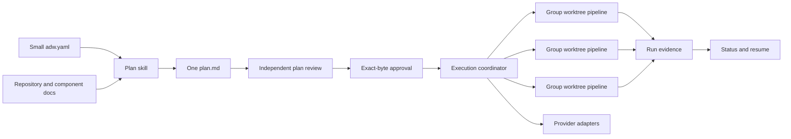

# PART 1 — ADW Simplification and Orchestration Redesign

> This document is the canonical implementation handoff for replacing ADW 0.6's schema-heavy sequential workflow with a simpler, generic, phased workflow. A new agent should be able to implement it without the conversation that produced it. PART 1 explains the product and architecture. PART 2 assigns exact repository work.

## Summary

ADW must remain reusable across different repositories, languages, build systems, code hosts, and work trackers. It should achieve that portability through one opinionated development workflow plus small project configuration and provider adapters—not through a large family of author-facing schemas and cross-digested artifacts.

The redesign restores the strongest parts of the previous ADW:

- one human-readable feature overview;
- one agent-executable implementation plan;
- dependency-ordered phases;
- parallel groups within a phase;
- one isolated worktree, branch, tracker child, and optional draft PR per group;
- independent implementation, review, correction, and validation stages;
- plan red-teaming before approval;
- plan-first amendment when design changes.

It retains the strongest parts of ADW 0.6:

- one shared Codex and Claude Code plugin;
- exact-byte human approval and drift detection;
- real exit-code, signal, timeout, and bounded-output validation evidence;
- path confinement, symlink defenses, atomic managed-file writes, and timeout process-tree termination;
- explicit authorization before external writes;
- Git-native resume and status reconstruction;
- provider-neutral capability boundaries;
- optional hardened managed development environments.

The normal developer experience must become smaller:

```text
install -> onboard -> status
                    -> plan -> approve -> execute -> draft PRs
                    -> quick for a genuinely small change
```

A developer must not need to understand JSON Schema, policy digests, profile digests, ordered approval manifests, payload profiles, generated helper internals, or receipt schemas to use ADW.

## Problem with the current design

ADW 0.6 simplified execution to one agent, one branch, and one sequential task list while expanding the artifact and validation framework around it. A planned change can require:

```text
spec.md
plan.yaml
integrations.yaml
approval.json
approval-history/
validation.json
external-events/
```

The plan snapshots `effective_policy`, validation, components, work-item profiles, and several digests. Execution then reloads, validates, recomputes, and compares those snapshots. This provides strong syntactic integrity, but it makes the workflow harder to understand and extend while removing the phase/group structure that enabled complex parallel delivery.

The redesign deliberately spends complexity on execution safety and resumability, not on authoring bureaucracy.

## Product principles

1. **Opinionated workflow, portable environment.** ADW defines how changes are designed, reviewed, approved, implemented, and validated. Projects define where code lives, how it is checked, and which providers they use.
2. **One canonical plan.** `plan.md` contains both human intent and executable work. Do not split the same change across a specification and a machine-authored plan.
3. **Agents interpret plans.** A capable coordinating agent reads structured Markdown under the execution skill. The canonical plan is not forced into YAML merely to make conventional parsing easy.
4. **Machines record runs.** Small JSON records are appropriate for runtime state produced and consumed by tooling. Humans do not author them.
5. **Exact approval, semantic execution.** Approval binds the exact plan bytes and docs commit. Plan review and execution use agent reasoning to judge architecture, anchors, independence, and requirement drift.
6. **Parallelism is explicit.** Phases are dependency barriers. Groups within a phase may run concurrently only when their affected paths and contracts are safely independent.
7. **Genericity lives at seams.** Languages, commands, components, providers, naming, isolation, delivery shape, and maximum parallelism are configurable. Core workflow semantics are not.
8. **External writes remain separate.** Plan approval authorizes local implementation of the plan; it does not authorize pushes, pull requests, tracker mutations, merges, releases, or deployments.
9. **Security is proportional.** Provider sandboxing is the lightweight default. Existing project devcontainers are preserved. The generated hardened devcontainer is an explicit opt-in, not a prerequisite for adopting ADW.
10. **No invisible compatibility framework.** This is a breaking 1.0 contract. Existing 0.6 projects receive a clear transition guide, not a permanent migration subsystem.

## Target user experience

### Project maintainer

```text
1. Install ADW through the provider plugin manager.
2. Run adw:init.
3. Review a small adw.yaml and generated project/component context.
4. Commit the project configuration and publish the docs branch.
5. Optionally enable the hardened managed devcontainer.
```

### Contributor

```text
1. Install ADW.
2. Run adw:onboard.
3. Authenticate only the providers the project uses.
4. Run adw:doctor if readiness is uncertain.
5. Use adw:status, adw:plan, adw:approve, adw:execute, and adw:quick.
```

### Maintainer-facing concepts

A maintainer should need to explain only:

- the docs branch stores durable ADW context and plans;
- substantial changes use `plan -> approve -> execute`;
- small changes use `quick`;
- phases run in order and groups within a phase can run in parallel;
- external writes always receive a separate preview and authorization;
- ADW never merges, releases, or deploys.

## Target architecture



The active Codex or Claude Code agent remains the coordinator. ADW does not introduce a daemon, hosted scheduler, or standalone agent service. Deterministic scripts handle Git worktrees, paths, digests, validation processes, and run records. Native provider subagent capabilities handle reasoning and code work.

## Canonical project configuration

Replace project schema 5 with a small, handwritten `adw: 1` contract:

```yaml
adw: 1

git:
  base_branch: main

docs:
  branch: docs
  worktree: worktrees/docs

execution:
  mode: orchestrated          # orchestrated | sequential
  max_parallel: 3
  isolation: provider-sandbox # provider-sandbox | project-devcontainer | managed-devcontainer

components:
  api:
    path: src/api
    validate:
      - dotnet test tests/Api.Tests

  web:
    path: apps/web
    validate:
      - npm test
      - npm run build

# Optional. Omit providers that the project does not use.
providers:
  work_tracker:
    provider: azure-devops
    required: false
    settings:
      organization: example
      project: platform
      hierarchy: feature-story

  code_host:
    provider: github
    required: false

# Optional plain-language conventions. They guide formatting but never authorize actions.
conventions:
  branches: Use ADW branch names.
  pull_requests: Keep group pull requests small and draft until reviewed.
```

Handwritten validation must enforce only operationally important invariants:

- `adw` equals `1`;
- base/docs branches and worktree paths are safe non-empty relative values;
- execution mode, isolation, and positive `max_parallel` are supported;
- component IDs are unique, paths are project-relative, and validation commands are non-empty strings;
- provider capability names are known and provider names are non-empty;
- credentials and secret-like settings are rejected;
- unknown provider-specific keys are allowed only inside `settings`.

Do not require command-source fields, component policy digests, enforcement profiles, payload profiles, or schema validation.

## Canonical plan format

Every substantial change has one file:

```text
changes/<change-id>/plan.md
```

The required shape is structured Markdown:

```markdown
# PART 1 — Feature Overview

## Summary
## Design & Architecture
## Key Decisions & Trade-offs
## Risks and Open Questions
## Acceptance Criteria

# PART 2 — Implementation Plan

## Plan at a glance
## Affected Components
## Context and Anchors
## Phase 1 — <name>
### Group: <stable-group-id>
## Phase 2 — <name>
### Group: <stable-group-id>
## Whole-feature validation
## Notes
```

PART 1 is written for engineers. It describes the problem, observable behavior, real components, control/data flow, alternatives, exclusions, risks, and acceptance criteria. It must be understandable without PART 2.

PART 2 is written for the coordinator and worker agents. It includes:

- a table mapping phases, groups, components, dependencies, tracker intent, and delivery intent;
- grep-able `file -> symbol` anchors rather than line numbers;
- one or more groups per phase;
- a stable phase ID and group ID;
- goal, component, dependencies, affected paths, and whether delivery uses a group PR or an integration PR;
- directive tasks with `IMPLEMENT`, optional `CONTRACT`, `PATTERN`, `GOTCHA`, `DONE WHEN`, and `VALIDATE` entries;
- exact non-interactive commands derived from repository manifests, CI, task runners, or authoritative documentation;
- self-contained feature-specific artifacts in Notes when workers need exact payloads, schemas, DDL, or pseudocode.

The plan is immutable after approval. Ticket IDs, PR URLs, progress markers, and validation results do not get written back into it. Runtime records hold that state. A design or scope change uses `adw:amend`, changes the plan bytes, and requires reapproval.

## Plan review

Restore `adw:review-plan` and make it the default final step of `adw:plan` before the plan is presented for approval.

The reviewer is a fresh subagent that receives only the plan and repository, not the planning conversation. It must check:

- whether the design solves the stated problem;
- the single load-bearing assumption most likely to cause rework or an incident;
- simpler alternatives and rejected alternatives;
- every `file -> symbol` anchor against live code;
- phase dependency order;
- path overlap and contract conflicts among groups marked parallel;
- completeness of worker context and Notes;
- whether validation commands are real and sufficient;
- whether every acceptance criterion maps to executable work and validation.

Objective defects are fixed in the plan. Judgment calls become explicit open decisions for the human. `needs-rework` prevents approval; `revise-recommended` is shown clearly; `ship-ready` may proceed.

This semantic review replaces most author-facing schema ceremony. It does not replace exact-byte approval or deterministic path/process safety.

## Approval contract

Approval binds one canonical plan instead of an ordered bundle:

```json
{
  "version": 1,
  "change_id": "tenant-throttling",
  "plan_path": "changes/tenant-throttling/plan.md",
  "plan_digest": "<sha256-of-exact-plan-bytes>",
  "plan_commit": "<40-hex-docs-commit-containing-those-bytes>",
  "approved_by": "Ada Lovelace",
  "approved_at": "2026-08-13T12:00:00Z",
  "status": "active"
}
```

`adw:approve` shows PART 1, the phase/group map, risks, validation, tracker intent, and delivery intent. It waits for a fresh human response, then writes `approval.json`.

Verification requires:

- exact current `plan.md` bytes match `plan_digest`;
- `plan_commit` exists on and is reachable from the docs branch;
- that commit contains byte-identical `plan.md`;
- status is `active`;
- change ID and plan path match the requested change.

Amendment copies the old approval to `approval-history/<plan-digest>.json`, marks it superseded with a reason and timestamp, edits `plan.md`, and leaves execution blocked until fresh approval. Keep this lifecycle because it supplies real value with little conceptual cost.

Do not retain generalized approval input ordering, plan/spec pairing, schema/plugin version binding, profile digests, or requirement digests.

## Execution modes

### Sequential

For a small cohesive plan, the coordinator uses one branch and worktree and executes groups in plan order. It still performs independent review and exact validation.

### Orchestrated

For a complex plan:

1. Verify approval and requested phase.
2. Verify all dependency phases are complete and, for group-PR delivery, merged into the configured phase base.
3. Interpret the selected phase into a bounded execution preview.
4. Show group IDs, goals, paths, branches, worktrees, tracker actions, delivery actions, and validation commands.
5. Create the phase run record and deterministic group branches/worktrees.
6. Run up to `max_parallel` groups concurrently.
7. Inside each group, run stages sequentially:

```text
implementation subagent
    -> independent review subagent
    -> fix every in-scope high-severity finding
    -> validation through deterministic process helper
    -> coordinator scope check
```

8. Stop the phase on an unexplained or scope-changing diff, unresolved high-severity finding, or required validation failure.
9. After all groups pass, offer separately authorized tracker/push/draft-PR actions.
10. Record exact results in the phase run record.

The implementation worker receives only its bounded group packet plus relevant PART 1 decisions, anchors, component context, and Notes. The reviewer receives the group packet, the complete PART 1 design, the base-to-worktree diff, and project conventions. Workers never commit, push, create tracker items, or create PRs; the coordinator owns Git and external actions.

Use native subagent facilities:

- Codex collaboration agents when running in Codex;
- Claude Code Agent tasks when running in Claude Code.

Do not hardcode model product names. Prefer the active provider's strong general implementation/review agents. Risk-based effort may be requested in provider-native language. If native subagents are unavailable, orchestrated execution stops and offers sequential fallback only after the user agrees.

## Branch, worktree, phase, and delivery rules

Default names:

```text
branch:   adw/<change-id>/<group-id>
worktree: worktrees/<change-id>/<group-id>
```

For every group, deterministic preparation records:

- plan digest;
- phase and group IDs;
- base branch and exact base commit;
- relative worktree and branch;
- interpreted task packet;
- affected paths and validation commands.

Two delivery strategies are supported per plan:

1. **Group PRs (default):** every group produces its own draft PR. A later phase starts only after the human merges all dependency group PRs into the configured base. ADW never merges them.
2. **Integration PR:** group branches remain local or remote implementation branches and the coordinator combines validated commits into `adw/<change-id>/integration` after all dependency groups pass. Conflict resolution is explicit and followed by whole-feature review and validation. ADW prepares one draft integration PR and never merges it.

Groups marked parallel must have disjoint write paths unless the plan explicitly defines a shared contract group in an earlier phase. Review-plan treats unexplained overlap as a blocking defect.

## Runtime records

Machine-generated state lives under:

```text
changes/<change-id>/runs/<phase-id>.json
```

A run record has one small handwritten contract:

```json
{
  "version": 1,
  "change_id": "tenant-throttling",
  "phase_id": "foundations",
  "plan_digest": "<sha256>",
  "base_branch": "main",
  "base_commit": "<40-hex>",
  "started_at": "<ISO timestamp>",
  "completed_at": null,
  "status": "running",
  "groups": {
    "contracts": {
      "branch": "adw/tenant-throttling/contracts",
      "worktree": "worktrees/tenant-throttling/contracts",
      "tasks": ["<interpreted directive>"],
      "affected_paths": ["src/contracts"],
      "tracker": null,
      "pull_request": null,
      "implementation_commit": null,
      "review": { "status": "pending", "high_findings": [] },
      "validation": { "status": "pending", "commands": [] },
      "status": "prepared"
    }
  }
}
```

Only the coordinator writes run records. Validate their operational fields with concise handwritten checks: safe IDs and paths, known statuses, exact commit/digest formats, unique branches/worktrees, and truthful validation outcomes. Do not introduce a JSON Schema engine.

Run records are committed locally on the docs branch so a later session can resume. Pushing docs, group branches, or PRs remains separately authorized. Absolute local paths, credentials, unrestricted logs, and raw external content are never recorded.

## Validation evidence

Keep the current reliable process mechanics from `src/helpers/runtime-bundle.mjs`:

- execute exact commands in confined project-relative working directories;
- preserve exit code, signal, timeout, and bounded redacted output;
- terminate process groups with SIGTERM/SIGKILL escalation;
- treat every required failure or deferral as failure;
- deduplicate repeated whole-plan commands conservatively;
- never hand-author a passing result.

Store group validation in the corresponding run record. Store final integration/whole-feature validation in a reserved `final` group or `runs/final.json`. Remove the separate author-facing `validation.json` contract.

## Provider adapters

The workflow depends on capabilities:

- `work_tracker`: read/create/update/link work;
- `code_host`: read/create/update draft pull requests;
- `observability`: bounded read-only investigation;
- `knowledge`: read or separately authorized publication.

Provider references translate those operations to an available native, MCP, CLI, or API transport. The core plan and skills never contain Azure DevOps field names, GitHub payload shapes, or Notion object schemas.

Replace generic work-item payload profiles with adapter defaults plus optional opaque project settings. The common tracker intents are:

- no tracker item;
- one parent item for the plan;
- one child item per execution group;
- link an existing parent or child instead of creating one.

Before any write, show the provider, target, operation, and redacted payload and obtain fresh authorization. Use stable idempotency markers and provider readback when supported. Record the resulting stable ID/URL and concise success/failure state in the run record. Do not require authorization digests or a separate external-action artifact for routine workflow operation.

An optional organization policy may require richer audit receipts later. That belongs in an opt-in adapter/policy package, not the core developer experience.

## Initialization, onboarding, and security

`adw:init` should produce only:

- small `adw.yaml`;
- bounded `AGENTS.md` and `CLAUDE.md` routing blocks;
- ignore entries for `.adw/` and `/worktrees/`;
- docs branch/worktree with `architecture.md`, `components/`, and `changes/`;
- optional ignored `.adw/local.yaml` and `.adw/preferences.md`;
- managed permission files required by the active providers;
- an optional generated `.devcontainer/` only when explicitly selected.

Default isolation selection:

1. preserve an existing project devcontainer and use `project-devcontainer`;
2. otherwise use `provider-sandbox` by default;
3. offer `managed-devcontainer` for projects wanting the stronger reproducible boundary.

Keep the existing security hardening implementation and its tests. Simplify its exposure: ordinary contributors should see only the configured isolation mode and whether doctor passes. They should not need to understand marker digests, proxy implementation, permission rule generation, or firewall internals.

`adw:onboard` attaches the docs branch, writes optional personal non-secret preferences, checks configured provider availability, and reports readiness. It must not rerun shared initialization or require Docker when the project does not use the managed container.

## Artifact layout

Target initialized project layout:

```text
code branch:
  adw.yaml
  AGENTS.md / CLAUDE.md bounded routing blocks
  .adw/local.yaml          ignored, optional
  .adw/preferences.md      ignored, optional
  worktrees/               ignored
  .devcontainer/           optional; project-owned or explicit managed mode

docs branch:
  architecture.md
  components/*.md
  changes/<change-id>/
    plan.md
    approval.json
    approval-history/*.json
    runs/<phase-id>.json
  SYNC.yaml
```

Remove from the core artifact model:

- `spec.md`;
- canonical `plan.yaml`;
- `integrations.yaml`;
- standalone `validation.json`;
- `external-events/` receipts;
- work-item profile YAML files;
- effective policy snapshots and digests.

## Helper boundary

Keep deterministic mechanics, but reduce the helper API to operations that genuinely need conventional code:

- parse and validate the small project config;
- compute a byte digest;
- create and verify the simple approval record;
- validate and update run records;
- prepare/confine group branches and worktrees;
- execute validation commands truthfully;
- resolve safe project paths;
- apply atomic managed-file writes.

Remove helper support for:

- general JSON Schema loading and validation;
- artifact registries and schema-version dispatch;
- effective project policy and policy digests;
- work-item payload profile validation;
- requirements digests;
- authorization digests;
- external-action receipt construction;
- approval bundles containing multiple ordered author inputs.

Keep the generated self-contained helper only if plugin packaging still requires bundled dependencies. Removing AJV and most schemas should make it much smaller. Do not introduce a public ADW CLI or daemon.

## Compatibility and release

This redesign is ADW 1.0 and intentionally breaks the 0.6 artifact contract.

- Change `VERSION`, both plugin manifests, marketplace metadata, and `package.json` together.
- Do not implement a general migration framework.
- Add `docs/migrating-from-0.6.md` with two supported choices:
  - finish an active 0.6 change using the pinned 0.6 plugin;
  - preserve old docs artifacts as history, install 1.0, run reviewed reinitialization, and re-plan active work as `plan.md`.
- `adw:doctor` must identify `schema: 5` configuration and return the exact transition guidance without modifying it.
- Existing merged code and historical docs remain untouched.

## Explicit exclusions

This redesign does not add:

- a hosted scheduler, daemon, workflow database, or standalone agent service;
- automatic merging, releasing, deployment, or force-pushing;
- a generic JSON Schema or migration platform;
- arbitrary tracker-field templating in core;
- automatic conflict resolution between group branches;
- credentials in project configuration or run records;
- backward execution of active 0.6 plans with the 1.0 plugin;
- a requirement that every project use Docker, a tracker, or a code host integration.

## Success criteria

The redesign is complete when:

1. A new developer can understand the workflow from README and onboarding without learning artifact schemas or digests.
2. An empty, existing, and polyglot monorepo can initialize with a small reviewed config.
3. A single `plan.md` is understandable to a human and executable by another agent without chat history.
4. Plan review catches stale anchors, unsafe parallel overlap, incomplete tasks, and unreal validation commands.
5. Editing an approved plan blocks execution until reapproval.
6. One phase can run at least two independent groups concurrently in isolated worktrees.
7. Every group receives independent implementation and review passes plus truthful validation.
8. Interrupted execution resumes from Git branches, worktrees, approval, and run records.
9. Group PR and integration PR delivery modes both work without ADW merging anything.
10. Projects with no integrations and no devcontainer retain the lightweight path.
11. Codex and Claude Code use the same plan, approval, run records, and workflow semantics.
12. The complete test suite passes and the 0.6 schema/profile machinery is absent from the released plugin.

---

# PART 2 — Implementation Plan

> Implement phases in order. Groups within the same phase may run in parallel only when their exclusive paths below remain disjoint. Each group uses its own branch and worktree and goes through implement, independent review, and validation. Do not silently change the product decisions in PART 1; amend this document first if a decision must change.

## Plan at a glance

| Phase | Group | Primary paths | Depends on | Delivery |
|---|---|---|---|---|
| 1 | `simple-runtime` | helper source/bundle, additive tests | — | group PR |
| 1 | `provider-adapters` | integration contracts/providers, additive tests | — | group PR |
| 2 | `planning-lifecycle` | plan/review/approve/amend skills and templates | Phase 1 | group PR |
| 2 | `execution-orchestration` | execute/status/quick/address-review and orchestration scripts | Phase 1 | group PR |
| 2 | `project-setup` | init/onboard/doctor/update and config generation | Phase 1 | group PR |
| 2 | `maintenance-workflows` | discover/investigate/sync-docs | Phase 1 | group PR |
| 3 | `contract-cleanup` | schemas/templates deletion, old helper removal, package dependencies | all Phase 2 groups | group PR |
| 4 | `integration-release` | shared tests, fixtures, README/docs/manifests/version/changelog | Phase 3 | integration PR |

## Global implementation rules

- Keep the repository green at the end of every phase. Phase 1 adds new APIs alongside old ones; Phase 3 removes old APIs only after every consumer has moved.
- Do not combine schema removal with the initial helper additions; that would make intermediate group branches impossible to validate independently.
- Do not edit the same file from parallel groups. If an unlisted shared file becomes necessary, stop and assign it to the integration phase or amend the ownership table.
- Preserve security fixes already present in permission hooks, firewall/proxy files, atomic writes, timeout handling, exact remote-ref matching, and managed Codex blocks.
- Use `apply_patch` for edits. Regenerate `plugin/lib/adw-helper.mjs` through `npm run build:helper`; never hand-edit the generated bundle.
- Every new script rejects absolute paths, `..`, NULs, symlink escapes, duplicate IDs, and targets outside the project root.
- Tests must exercise behavior, not only scan prose. Contract text tests remain useful for provider parity but cannot be the only coverage for runtime mechanics.

## Phase 1 — Add the simple runtime beneath the existing workflow

### Group: `simple-runtime`

**Goal:** Add the small 1.0 config, approval, run-record, validation, and worktree mechanics without removing 0.6 APIs yet.

**Exclusive paths:**

- `src/helpers/runtime-bundle.mjs`
- `src/helpers/build-bundle.mjs`
- `plugin/lib/adw-helper.mjs` generated output
- `plugin/execution/orchestrator.mjs` new
- `tests/helpers/simple-contracts.test.mjs` new
- `tests/integration/orchestration-mechanics.test.mjs` new
- `tests/contracts/cross-provider-contracts.test.mjs` transition-only compatibility update

**Read first:**

- `src/helpers/runtime-bundle.mjs` -> `createApprovalBundle`, `verifyApprovalBundle`, `runValidationCommand`, `resolveProjectPath`, `applyAtomicWrites`, and `dispatch`
- `src/helpers/build-bundle.mjs` -> bundle entry/build behavior
- `tests/helpers/approval.test.mjs` -> exact-byte drift expectations
- `tests/helpers/validation.test.mjs` -> truthful failure and timeout expectations
- `tests/helpers/atomic-writes.test.mjs` -> confinement and rollback expectations

**IMPLEMENT:** Add handwritten project-config normalization and validation.

- Accept the `adw: 1` shape defined in PART 1.
- Preserve YAML 1.2 duplicate-key rejection.
- Reject unsafe paths, secret-like settings, invalid modes, empty commands, and malformed components.
- Return normalized data and the digest of exact source bytes.
- Do not use `validateJsonSchema` for this path.

**IMPLEMENT:** Add simple approval functions.

- Create `createPlanApproval` and `verifyPlanApproval` using exact `plan.md` bytes and `plan_commit`.
- Validate active/superseded lifecycle with concise handwritten checks.
- Keep old bundle approval functions temporarily for 0.6 tests until Phase 3.

**IMPLEMENT:** Add run-record functions.

- Create, validate, and monotonically update the Phase Run Record described in PART 1.
- Require truthful state transitions: `prepared -> implementing -> reviewing -> validating -> passed|failed|blocked` for groups and `running -> passed|failed|blocked` for phases.
- Reject a passed validation containing a required nonzero exit, signal, timeout, or deferral.
- Bound and redact summaries with the existing helper behavior.

**IMPLEMENT:** Add `plugin/execution/orchestrator.mjs` for deterministic Git mechanics only.

- Expose non-interactive functions/commands to preview and prepare group branches/worktrees from an explicit project root, base commit, change ID, phase ID, and group packet.
- Use `adw/<change-id>/<group-id>` and `worktrees/<change-id>/<group-id>` defaults.
- Reuse a matching branch/worktree only when its recorded base and packet match.
- Refuse dirty, ambiguous, symlinked, duplicate, mismatched, or already-owned targets.
- Never spawn agents, commit implementation, push, create PRs, or mutate trackers.
- Provide cleanup guidance but do not delete a worktree or branch automatically.

**IMPLEMENT:** Make the shared skill inventory test transition-safe before Phase 2 adds `review-plan`.

- During the transition, accept `review-plan` when present and test its full contract when present.
- Permit either the legacy sequential execute wording or the new phased/orchestrated wording until Phase 4 locks the 1.0 inventory.
- Do not weaken provider parity, frontmatter, resource-resolution, or safety assertions.
- Phase 4 removes this temporary dual-contract allowance and makes `review-plan` mandatory.

**DONE WHEN:** New runtime APIs and orchestrator tests pass alongside every existing 0.6 test.

**VALIDATE:**

```bash
node --test tests/helpers/simple-contracts.test.mjs tests/integration/orchestration-mechanics.test.mjs tests/helpers/approval.test.mjs tests/helpers/validation.test.mjs tests/helpers/atomic-writes.test.mjs
npm run check:helper
npm test
```

### Group: `provider-adapters`

**Goal:** Simplify integrations to capability adapters and tracker/delivery intents without changing workflow skills yet.

**Exclusive paths:**

- `plugin/integrations/contracts.md`
- `plugin/integrations/providers.json`
- `plugin/integrations/providers/*.md`
- `plugin/integrations/adapters/` new, only if executable adapter helpers are genuinely needed
- `tests/integration/provider-adapters.test.mjs` new

**Read first:**

- `plugin/integrations/contracts.md` -> capability resolution, bindings, and mutation authorization
- `plugin/integrations/providers.json` -> current capability/transport registry
- each file under `plugin/integrations/providers/`
- `tests/helpers/external-actions.test.mjs` -> idempotency/readback lessons to retain

**IMPLEMENT:** Replace profile/payload language with four provider-neutral operations and simple tracker intents.

- Keep provider and transport separate.
- Keep disabled/optional/required availability behavior.
- Define one parent per plan and optional one child per group.
- Define link-existing and create-if-authorized behavior.
- Keep pre-write target/payload preview, fresh authorization, idempotency when supported, and readback.
- Return stable IDs/URLs and concise outcomes for run records.
- Remove authorization-digest and mandatory external-receipt requirements from the new contract, but do not delete old helper code yet.

**IMPLEMENT:** Make initial provider references concrete and short.

- Azure DevOps: Feature/User Story defaults with optional project settings.
- GitHub: draft PR and optional Issues tracker behavior.
- Datadog: bounded read-only observability.
- Notion: read and separately authorized publication.
- No provider reference may leak its field model into the canonical plan format.

**DONE WHEN:** A no-provider project needs no probes, and GitHub/Azure DevOps can describe parent/group tracker operations without work-item profiles.

**VALIDATE:**

```bash
node --test tests/integration/provider-adapters.test.mjs tests/contracts/cross-provider-contracts.test.mjs
npm test
```

## Phase 2 — Move every workflow to the new contract

### Group: `planning-lifecycle`

**Goal:** Replace `spec.md` plus `plan.yaml` with one reviewed `plan.md` and simple exact-byte approval.

**Exclusive paths:**

- `plugin/skills/plan/`
- `plugin/skills/review-plan/` new
- `plugin/skills/approve/`
- `plugin/skills/amend/`
- `plugin/templates/plan.md` new
- `tests/integration/plan-contract.test.mjs`
- `tests/integration/approval-lifecycle.test.mjs`
- `tests/integration/review-plan-contract.test.mjs` new

**Read first:**

- current `plugin/skills/plan/SKILL.md` -> repository exploration and safety boundaries to retain
- current `plugin/skills/approve/SKILL.md` -> two-step human confirmation
- current `plugin/skills/amend/SKILL.md` -> history preservation and reapproval
- this document -> Canonical plan format, Plan review, and Approval contract

**IMPLEMENT:** Rewrite `adw:plan` around one Markdown artifact.

- Generate `changes/<change-id>/plan.md` from `plugin/templates/plan.md`.
- Use the mandatory PART 1/PART 2 structure from this document.
- Restore phases and parallel groups, stable IDs, glance table, anchors, directive tasks, done-when checks, validation, and Notes.
- Never create code branches/worktrees or implement tasks.
- Tracker reads may inform planning; tracker writes still require exact separate authorization.
- Run a fresh independent `adw:review-plan` pass before presenting the plan to the human.
- Commit only `plan.md` and separately authorized planning-time provider outcomes on the docs branch.

**IMPLEMENT:** Add `adw:review-plan`.

- Use the semantic checks in PART 1.
- Read plan and live code, not prior chat.
- Emit `ship-ready`, `revise-recommended`, or `needs-rework`, the weakest point, ranked findings, and per-anchor results.
- Never modify the plan itself when invoked standalone.
- `adw:plan` applies objective findings and surfaces judgment calls.

**IMPLEMENT:** Simplify approval and amendment.

- Approval reads one exact `plan.md`, records the simple approval object, and never asks the human to copy a digest.
- Amendment supersedes and archives current approval before editing the plan.
- Shipped runtime records remain historical; amendment does not rewrite them.
- Any plan-byte change requires fresh approval.

**DONE WHEN:** A human can understand PART 1 alone, a worker can execute PART 2 without chat, stale plan bytes block execution, and no planning skill references plan schemas, effective policy, payload profiles, or `spec.md`.

**VALIDATE:**

```bash
node --test tests/integration/plan-contract.test.mjs tests/integration/approval-lifecycle.test.mjs tests/integration/review-plan-contract.test.mjs
npm test
```

### Group: `execution-orchestration`

**Goal:** Restore phase/group worktree orchestration and runtime state using provider-native subagents.

**Exclusive paths:**

- `plugin/skills/execute/`
- `plugin/skills/status/`
- `plugin/skills/quick/`
- `plugin/skills/address-review/`
- `plugin/execution/contracts.md`
- `tests/integration/execute-contract.test.mjs`
- `tests/integration/status-readonly.test.mjs`
- `tests/integration/quick-contract.test.mjs`
- `tests/integration/orchestrated-execution.test.mjs` new

**Read first:**

- current `plugin/skills/execute/SKILL.md` -> approval, path, command, base, review, and delivery guards
- current `plugin/skills/status/scripts/snapshot.mjs` -> Git/docs reconstruction
- `plugin/execution/orchestrator.mjs` from Phase 1
- this document -> Execution modes, Branch/worktree rules, and Runtime records

**IMPLEMENT:** Rewrite `adw:execute` as a coordinator.

- Support `phase=<phase-id>` and sequential/orchestrated project modes.
- Verify one approved plan and requested phase.
- Build and show a bounded execution preview from Markdown interpretation.
- Persist the packet in the phase run record before worker launch.
- Prepare deterministic worktrees through the orchestrator.
- Spawn implementation groups concurrently up to `max_parallel`.
- For every group, run implementation, independent review/fix, deterministic validation, and coordinator scope classification.
- Do not hardcode Claude model names or provider workflow globals.
- Stop on scope drift, unsafe overlap, unresolved high findings, or required failure.
- Offer group-PR or integration-PR delivery only after passed evidence and fresh authorization.
- Never merge, release, deploy, or force-push.

**IMPLEMENT:** Rewrite status around plan/approval/run records and Git.

- Report plan review/approval, phases, group branches/worktrees, tracker IDs, PRs, validation, blocked reasons, and next action.
- Derive status from durable artifacts and Git, not chat.
- Remain read-only and ignore hostile/symlinked entries.

**IMPLEMENT:** Align quick and address-review.

- Quick remains one branch with no plan and escalates multi-component/dependent work to `adw:plan`.
- Address-review reconstructs whether the target is a group PR or integration PR and routes design changes through amendment.
- Both reuse truthful validation/run-record mechanics where applicable.

**DONE WHEN:** A fixture can run two file-disjoint groups concurrently, stop one failed group without corrupting another, resume from records, and report accurate status.

**VALIDATE:**

```bash
node --test tests/integration/execute-contract.test.mjs tests/integration/orchestrated-execution.test.mjs tests/integration/status-readonly.test.mjs tests/integration/quick-contract.test.mjs
npm test
```

### Group: `project-setup`

**Goal:** Make initialization and contributor onboarding lightweight while retaining optional hardening.

**Exclusive paths:**

- `plugin/skills/init/`
- `plugin/skills/onboard/`
- `plugin/skills/doctor/`
- `plugin/skills/update/`
- `plugin/templates/adw.yaml`
- `plugin/templates/preferences.md`
- `tests/integration/fixture-init.test.mjs`
- `tests/integration/init-idempotent.test.mjs`
- `tests/integration/onboarding*.test.mjs`
- `tests/integration/contributor-onboarding.test.mjs`
- `tests/integration/managed-devcontainer.test.mjs`
- `tests/integration/update-repair.test.mjs`
- `tests/integration/security-hostile-content.test.mjs`

**Read first:**

- `plugin/skills/init/scripts/init.mjs` -> `detectCommands`, `discoverComponents`, `projectConfiguration`, `plannedFiles`, and docs initialization
- `plugin/skills/init/scripts/development-environment.mjs` -> environment discovery and managed files
- `plugin/skills/onboard/scripts/onboard.mjs` -> docs ref attachment and local preview
- `plugin/skills/doctor/scripts/snapshot.mjs` -> project and execution checks
- `plugin/skills/update/scripts/update.mjs` -> managed-file repair

**IMPLEMENT:** Generate the `adw: 1` configuration and new docs layout.

- Keep evidence-based component and validation discovery, but render the small config.
- Remove work-tracker workflow/profile onboarding questions.
- Ask only about execution mode, isolation, optional providers, missing validation, and concise conventions.
- Preserve both routing files and project-owned tooling.
- Default to existing project devcontainer or provider sandbox; managed devcontainer is explicit opt-in.
- Create `changes/` without spec/plan/schema templates.

**IMPLEMENT:** Simplify onboarding and doctor output.

- Onboard must not require Docker for provider-sandbox projects.
- Doctor validates handwritten config and only the configured isolation/providers.
- Hide managed marker internals behind concise pass/fail details unless diagnosis needs them.
- Detect 0.6 `schema: 5` and report the transition guide without writes.

**IMPLEMENT:** Keep update narrowly scoped.

- Plugin managers update plugin code.
- `adw:update` repairs only release-owned managed permission/devcontainer files when managed mode is configured.
- It never rewrites project config, plans, approvals, or run history.

**DONE WHEN:** Empty/existing/monorepo fixtures initialize with a readable small config, ordinary contributors can onboard without Docker, and managed security tests remain green.

**VALIDATE:**

```bash
node --test tests/integration/fixture-init.test.mjs tests/integration/init-idempotent.test.mjs tests/integration/onboarding.test.mjs tests/integration/onboarding-init.test.mjs tests/integration/contributor-onboarding.test.mjs tests/integration/managed-devcontainer.test.mjs tests/integration/update-repair.test.mjs
npm test
```

### Group: `maintenance-workflows`

**Goal:** Align discover, investigate, and docs synchronization with the simple config/artifact model.

**Exclusive paths:**

- `plugin/skills/discover/`
- `plugin/skills/investigate/`
- `plugin/skills/sync-docs/`
- `tests/integration/investigate-contract.test.mjs`
- `tests/integration/docs-sync.test.mjs`

**IMPLEMENT:** Update resource and artifact references.

- Discover continues to produce architecture/component context and verified commands.
- Investigate emits a concise Markdown or small handwritten-validated JSON report without the incident JSON Schema.
- Sync-docs continues to compare `SYNC.yaml`, report read-only by default, and update only after authorization.
- None of these skills may depend on project schema 5, artifact-schema dispatch, or external-action receipts.

**DONE WHEN:** All three workflows operate against `adw: 1` and the new docs layout without adding developer-facing artifacts.

**VALIDATE:**

```bash
node --test tests/integration/investigate-contract.test.mjs tests/integration/docs-sync.test.mjs
npm test
```

## Phase 3 — Remove superseded machinery

### Group: `contract-cleanup`

**Goal:** Delete the old artifact framework only after every workflow consumes the new APIs.

**Exclusive paths:**

- `plugin/schemas/` delete entire directory
- `plugin/templates/spec.md` delete
- `plugin/templates/plan.yaml` delete
- `plugin/templates/integrations.yaml` delete
- `plugin/templates/work-item-profile.yaml` delete
- `src/helpers/runtime-bundle.mjs` old API removal
- `plugin/lib/adw-helper.mjs` regenerated output
- `package.json`
- `package-lock.json`
- `tests/helpers/artifact-file.test.mjs` delete/replace
- `tests/helpers/approval.test.mjs` update to the simple approval contract
- `tests/helpers/schema-validation.test.mjs` delete/replace
- `tests/helpers/project-policy.test.mjs` delete/replace
- `tests/helpers/external-actions.test.mjs` delete/replace
- `tests/helpers/cli.test.mjs` update to reduced dispatch
- `tests/contracts/helper-bundle-equivalence.test.mjs`
- `tests/contracts/helper-reproducibility.test.mjs`
- `tests/integration/security-paths.test.mjs` update to handwritten config/run-record path validation

**IMPLEMENT:** Remove JSON Schema infrastructure and unused helper APIs.

- Remove `ARTIFACT_SCHEMAS`, general schema loading/validation, policy resolution/digests, work-item payload validation, requirement/authorization digests, external-action construction, and ordered multi-input approval bundles.
- Preserve YAML parsing, small config validation, plan approval, run records, validation processes, safe paths, and atomic writes.
- Remove AJV from dependencies. Keep YAML and build tooling only when still needed.
- Regenerate and measure the helper bundle; document why any remaining large bundled dependency is necessary.

**IMPLEMENT:** Delete superseded templates/schemas/tests and replace behavior coverage where a retained invariant would otherwise be lost.

**DONE WHEN:** `rg` finds no live reference to deleted schemas/templates, no author workflow calls `validateArtifact`, and helper reproducibility remains exact.

**VALIDATE:**

```bash
rg -n "plugin/schemas|plan\.yaml|spec\.md|integrations\.yaml|work-item-profile|effective_policy|project_policy_digest|profile_digest|validateArtifact|external-events" plugin src tests package.json
npm run build:helper
npm run check:helper
npm test
```

The `rg` command may match only the 0.6 migration guide, changelog history, or explicit statements that those artifacts were removed.

## Phase 4 — Integrate, document, and release 1.0

### Group: `integration-release`

**Goal:** Reconcile all branches, update shared contracts and documentation, run complete provider/security verification, and prepare the breaking release.

**Exclusive paths:**

- `README.md`
- `PRD.md`
- `IMPLEMENTATION_PLAN.md`
- `docs/`
- `CHANGELOG.md`
- `VERSION`
- `package.json` version only
- `plugin/.codex-plugin/plugin.json`
- `plugin/.claude-plugin/plugin.json`
- root marketplace metadata under `.agents/` and `.claude-plugin/`
- `tests/contracts/cross-provider-contracts.test.mjs`
- `tests/contracts/plugin-packaging.test.mjs`
- shared fixtures under `tests/fixtures/`

**IMPLEMENT:** Replace the historical sequential product story.

- Make this document's workflow the current PRD/README contract.
- Document the two-part plan with a realistic multi-language example.
- Document sequential and orchestrated modes, group and integration PR strategies, provider adapters, onboarding, security choices, resume, and amendment.
- Add `docs/migrating-from-0.6.md`.
- Move detailed managed-container internals to security documentation; keep the main onboarding path short.

**IMPLEMENT:** Update shared provider inventory and release metadata.

- Add `review-plan` to both provider manifests/metadata and required-skill tests.
- Confirm one physical skill tree remains shared.
- Set the breaking release version consistently to `1.0.0`.
- Changelog must explain both restored capability and removed ceremony.

**IMPLEMENT:** Add end-to-end fixtures.

- Lightweight project with no integrations and provider sandbox.
- Existing devcontainer project.
- Polyglot monorepo with at least two components and different validation commands.
- Orchestrated change with two independent Phase 1 groups and one dependent Phase 2 group.
- Group-PR delivery state and integration-PR delivery state.
- Interrupted run and resume.
- Stale approval after plan edit.
- 0.6 project diagnosis with no automatic mutation.

**VALIDATE:**

```bash
npm test
npm run check:helper
git diff --check
claude plugin validate --strict plugin
claude plugin validate --strict .claude-plugin/marketplace.json
```

Run `npm run test:security` when Docker, jq, and shellcheck are available. If a prerequisite is unavailable, report it explicitly and retain the ordinary managed-container tests in `npm test`.

## Manual acceptance scenarios

Before calling 1.0 complete, run these with both Codex and Claude Code where provider functionality exists:

1. Initialize and onboard a small repository without Docker or integrations.
2. Create a plan with one human design section and two parallel groups.
3. Run review-plan cold and fix an intentionally stale anchor.
4. Approve the exact plan, edit one byte, and prove execute stops.
5. Restore and reapprove the plan.
6. Execute two Phase 1 groups concurrently in isolated worktrees.
7. Produce an implementation defect, have independent review identify/fix it, and rerun validation.
8. Interrupt after one group passes, start a new session, and resume from Git/run records.
9. Preview and authorize tracker child creation and draft group PRs.
10. Confirm ADW never merges the PRs and Phase 2 waits for dependency merges.
11. Exercise integration-PR mode in a separate fixture.
12. Onboard a second developer who only needs the five core workflow concepts.

## Final definition of done

- One canonical structured Markdown plan replaces the spec/plan machine bundle.
- The plan is independently red-teamed and exact-byte approved.
- Complex work supports phases, parallel groups, isolated worktrees, subagents, child tracker items, and group or integration draft PRs.
- Runtime JSON is machine-generated, small, safe, and invisible during ordinary planning.
- The core project config is readable without schema documentation.
- Provider adapters keep ADW portable without leaking provider payload models into plans.
- Provider sandbox is the lightweight default; managed hardening remains available and tested.
- Status and resume work without chat history.
- The JSON Schema/profile/policy-digest framework is removed from the released core.
- Existing security and truthful-validation guarantees remain covered.
- README/onboarding explain the workflow to a new developer in a few minutes.
- All automated and manual acceptance gates above pass.
