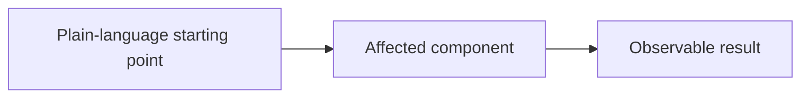

# <Change title>

Optional skeleton for `adw:plan` when the user asks for a plan file. Nothing
parses this file — it is a shape, not a contract. Rename, reorder, or drop
sections whenever the change is better served that way.

## Feature overview

What problem this solves and what changes for the people who use the software.
This section must stand on its own for a reader who never sees the phases below.
Use ordinary words and explain specialized terms on first use.

### Current behavior

Walk through what happens today and why it is a problem.

### Future behavior

Walk through what will happen after the change, including the visible result.

### Scope

**In scope:** what this plan delivers.

**Out of scope:** what this change deliberately does not do.

**Assumptions and open decisions:** facts the design relies on and choices that
still need an answer. Distinguish confirmed repository facts from proposals.

## Acceptance criteria

- **AC1:** an observable, checkable statement. Not an implementation step.

## Technical approach

Explain the full path from the entry point through each affected component to
the output, stored data, or external service. Anchor it to existing code with
grep-able `path -> symbol` references rather than line numbers.

Explain the diagram in plain words, including the success path and where errors
return. Add a second Mermaid diagram for phase dependencies and parallel groups
when that ordering is not obvious.

## Acceptance coverage

| Criterion | Implemented by | Proven by |
|---|---|---|
| AC1 | Phase 1, Group `example` | Named automated test or validation command |

## Cross-cutting effects

- **Compatibility and migration:** impact on existing callers, stored data, and
  deployment order, or `Not applicable` with a reason.
- **Failure and edge cases:** invalid input, partial failure, retries, empty or
  boundary values, and recovery behavior.
- **Security and privacy:** trust boundaries, permissions, secrets, and sensitive
  data, or `Not applicable` with a reason.
- **Performance:** expected cost, scale limits, and resource impact, or `Not
  applicable` with a reason.
- **Observability:** logs, metrics, traces, and actionable error messages, or
  `Not applicable` with a reason.
- **Rollout and rollback:** safe release order, feature flags, fallback, and data
  rollback limits, or `Not applicable` with a reason.
- **Documentation:** user, operator, API, and architecture pages to update, or
  `Not applicable` with a reason.

## Implementation plan

### Phase 1 — <what this phase delivers>

What this phase delivers, what it requires, why it comes here, and what it
unblocks.

#### Group `<group-id>`

- **Goal:** the concrete result owned by this group.
- **Existing anchors:** grep-able `path -> symbol` references and what role each
  one plays.
- **Tasks:** ordered, specific instructions complete enough for an agent that
  sees only this text. Explain behavior and interactions, not just file edits.
- **Writes:** the exact project-relative paths this group will write. Groups in
  one phase must have disjoint write paths.
- **Interfaces and data:** request/response shapes, types, schemas, events, or
  persisted data that change. Say `None` when nothing changes.
- **Failure and edge cases:** the behavior this group must preserve or add.
- **Acceptance criteria:** the ids this group implements.
- **Validation:** the commands that prove this group works.

#### Phase validation

The commands that prove the phase works as a whole.

### Phase 2 — <...>

## Whole-change validation

The automated and manual checks that prove every acceptance criterion once all
phases have landed. Explain what each command or check proves.

## Rollout and recovery

Release order, compatibility constraints, monitoring, rollback steps, and any
irreversible operation. Say why this is simple when no special process is needed.

## Risks and open questions

For each risk, state the concrete failure, likely impact, and mitigation or
recovery. List unresolved decisions separately with the owner or information
needed to answer them.
